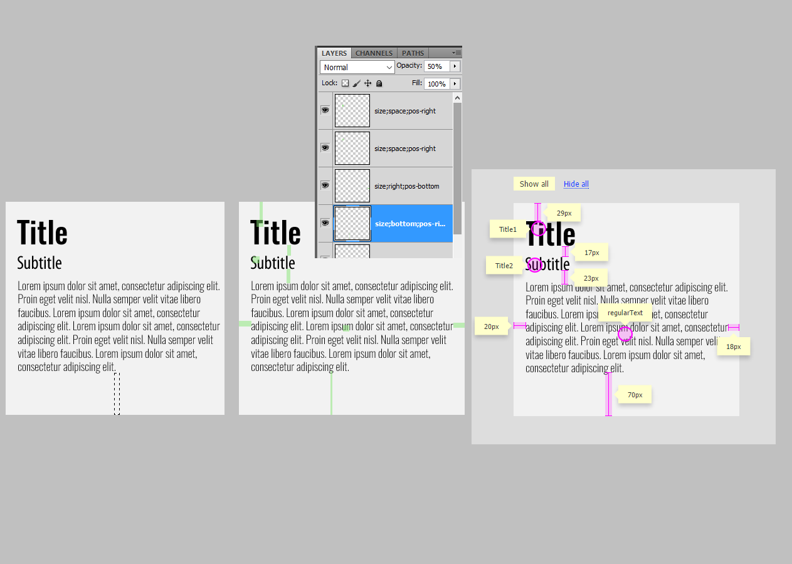

# specs-on-image

Specs on Image is a Photoshop script for web designers and front-end engineers

### Install
1. Place .jsx files in the Photoshop Scripts folder. If you have more than one version of Photoshop, place the script in the Scripts folder of each version.
OS X: `/Applications/[Photoshop]/Presets/Scripts/`
Windows: `C:\[Program Files]\Adobe\[Photoshop]\Presets\Scripts`
2. Restart Photoshop. The scripts should now be available in 
`File ▸ Scripts ▸ widthXheight`,
`File ▸ Scripts ▸ widthXheightSave`.
3. Next, let’s make a shortcut. `Edit ▸ Keyboard Shortcuts...`

e.g.
for widthXheight
OS X: `Shift+Cmd+W`
Windows: `Shift+Ctrl+W`

for widthXheightSave
OS X: `Shift+Cmd+R`
Windows: `Shift+Ctrl+R`

### Usage

1. Create a rectangular selection with Rectangular Marquee Tool (M) and use your shortcut (see Install section).
2. `Shift+Ctrl+W`.
3. Rename Layer. Example `Spec-Description` *Important*: use `-` minus character to separate spec name and description.
4. `Shift+Ctrl+R`. Choose file name `news-card.html` and destination and save the html file. 

Now you have news-card.html with spec titles over the image. The original image is not changed.
